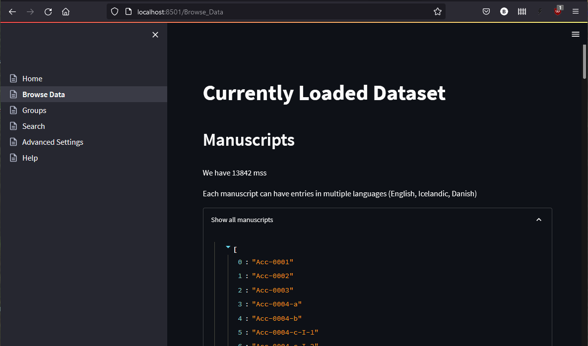

# Browse Data

To get an impression of the data loaded by the tool, you can visit the `Browse Data` page.

Here you will find information on the number of manuscripts, texts and people in our database, as well as seeing a list 
of all entries. Note that those lists are not designed to be human readable; if you are looking for something particular
you may want to check the [Search](search.md) page.

*Fig.: Browse Data Page - List of all Manuscripts*

The database contains roughly 13.800 unique manuscripts, 31.000 text titles and 11.000 people.

> Note that a precise count of manuscripts of any collection is hard to give, as it is up to scholarly debate, what 
> makes up a singular unit of a manuscript, fragment, etc. (And even more so the notion of a "text"!)  
> Even though we strife to implement all algorithms of our tools based on informed decisions, we merely aggregate 
> existing data in a quantitative manner. Any of the data presented here should be understood as the starting point for 
> scholarly debate rather than scientific consent. For a quotable version of the data, you should always refer back to
> the original catalogue data on [Handrit.is](https://handrit.is/).

> While the data on Handrit may contain multiple entries for a single manuscript in different languages, we have 
> attempted to unify these entries in order to provide the most complete metadata possible.  
> "Texts" have been treated as the literal string provided in the data; no attempt to unify these are being made as of 
> yet. This means that different spellings or a name in different languages will be treated as separate "texts" here.
