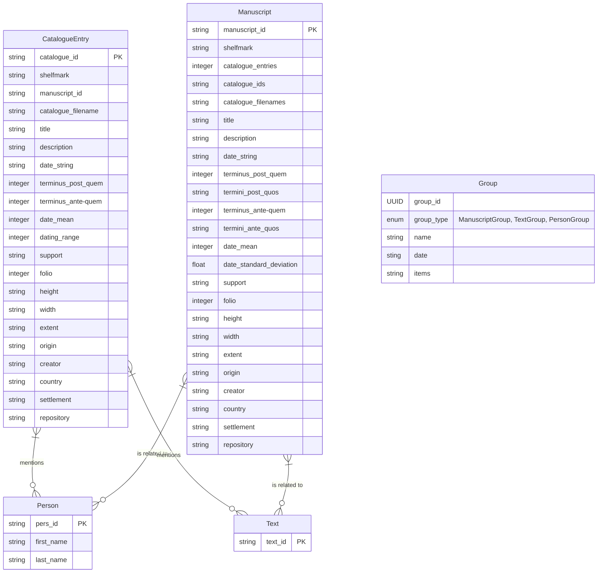

# Database Model

The database model still needs some streamlining. 
There are open GitHub issues for that.

The model currently contains the following entities:

- `Manuscript`:  
  The physical, text-bearing object. 
  Can be a full manuscript or a fragment.
- `Catalogue Entry`:  
  A description of a `Manuscript` in a catalogue. 
  There can be multiple `Catalogue Entries` describing a single `Manuscript`, 
  which may just be in different languages, 
  vary in their extent,
  or even have contradicting information.
- `Person`:  
  A person that is connected in one or another way to a `Manuscript` or `Catalogue Entry`.
- `Text`:  
  A text, as contained by a manuscript.
- `Group`:  
  A user defined grouping of `Manuscripts`, `People` or `Texts`.  
  Groups are used to save and combine search results, 
  in order to display the results together.

## Entity Relationship Diagram

Where string values represent a list of values, those values are concatenated with `|`. 
In the future, these relationships will be modelled as one-to-many relationships in the database.
