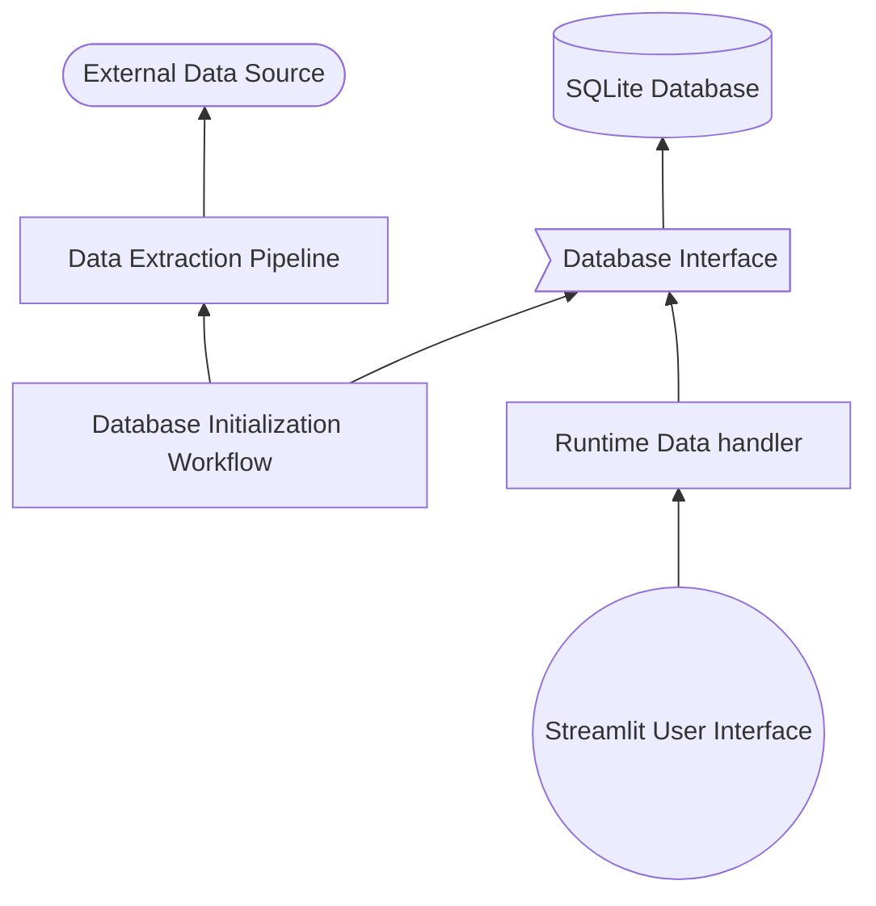

# Technical Overview

The tool at hand does not provide its own data, 
instead it aggregates data from [Handrit.is](https://handrit.is/). 
In the future, other data sources could be added.

Provided external data, the tool can extract a pre-defined set of information
and store it in a database. 
We currently use an SQLite database,
but by design, the tool is independent of the database implementation 
and can work with any database by simply adding a new database connector
that adheres to the defined database interface. 
The same principal of decoupling by means of dependency inversion
should be applied to the data extraction pipeline in the future, 
to accommodate simple "plug-and-play" addition of further data sources. However, this has not yet been addressed.

The current macro architecture looks as follows:

Arrows indicate direct dependency.
